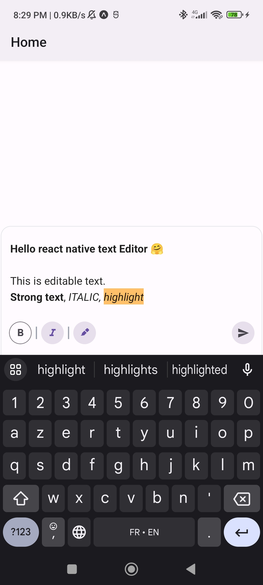

# rn-text-editor (⚠️ BETA Version)

rn-text-editor - Built on top of [ProseMirror](https://prosemirror.net/)

`rn-text-editor` is an evolving and feature-rich text editor package for React Native that's currently under active development. This package offers a range of functionalities for creating and managing text content in your React Native applications. `While it's not stable yet`, we invite you to explore its capabilities, contribute to its improvement, and share your feedback with the community.

## TODO

- [x] Setup a basic schema
- [x] Handle cursor position (Selection)
- [x] handle onKeyPressed (insert new text or remove it based on the selection)
- [x] Menu actions
- [x] Plugins + Extensions Support
- [ ] Documentations
- [x] Dynamic schema


## Features

1. Customizable: Tailor the text editor to suit your application's requirements with various configuration options.
2. Rich Text Support: Easily incorporate rich text elements, such as bold and italic formatting, into your content.

## Demo



## Installation

To get started with rn-text-editor, install the package using npm or yarn:
```sh
npm install rn-text-editor
# or
yarn add rn-text-editor

```

## Usage


> See example folder.

Explore the package in its current state and feel free to contribute to its development. Integration is straightforward and can be done as follows:

```js
import { StyleSheet, TextInput, View } from 'react-native';
import { EditorContent, extensions, useEditor } from 'rn-text-editor';

const EditorScreen = ({}: EditorScreenProps) => {
  const inputRef = React.useRef<TextInput>(null);
  const editor = useEditor({
    initialContent: [],
    extensions: [extensions.EditorCommands, extensions.Bold, extensions.Italic],
    onUpdate(props) {
      // Get the updated value!
      console.log(props.editor.contentAsJson());
    },
  });
  return (
        <EditorContent
          editor={editor}
          placeholder="Write something..."
          inputRef={inputRef}
          autoFocus
          style={tw`pl-2 text-base`}
        />
  );
};
```

## Contributing

See the [contributing guide](CONTRIBUTING.md) to learn how to contribute to the repository and the development workflow.

## License

MIT

---

Made with [create-react-native-library](https://github.com/callstack/react-native-builder-bob)
